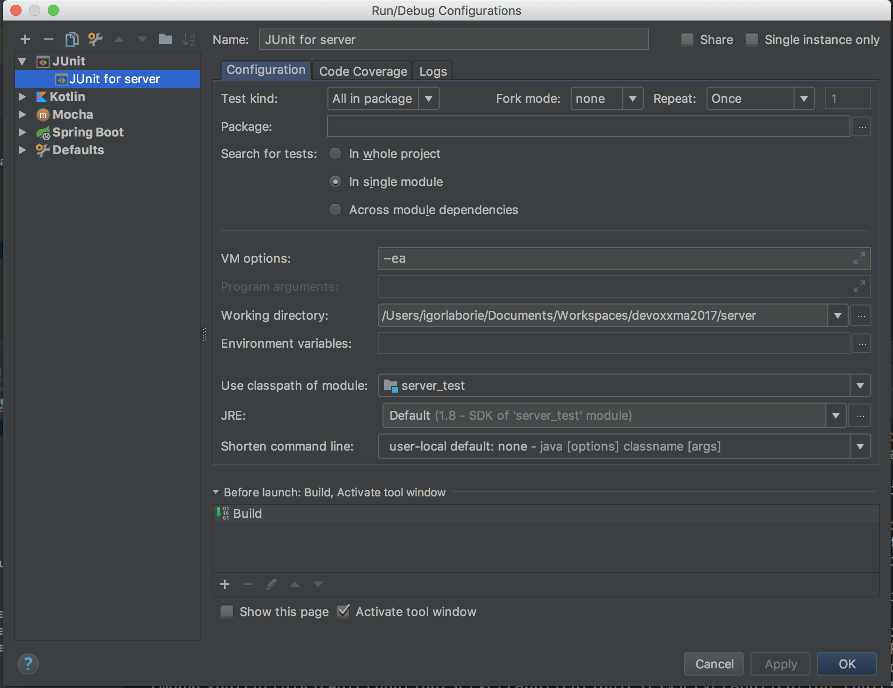

Kotlin by example - Server
===

This application is written in Kotlin using SpringBoot 2.
The purpose is to provide a REST endpoint to solve the [Water Pouring Puzzle](https://en.wikipedia.org/wiki/Water_pouring_puzzle).

For the HTTP request like that:

```HTTP
POST http://localhost:8080/api/solve
Content-Type: application/json

{
  "first": [
      { "capacity": 9, "current": 0},
      { "capacity": 4, "current": 0}
  ],
  "second": [
      { "capacity": 9, "current": 6},
      { "capacity": 4, "current": 0}
  ]
}
```

It should respond a JSON like that :

```json
[
  { "type": "Fill", "index": 0 },
  { "type": "Pour", "from": 0, "to": 1 },
  { "type": "Empty", "index": 1 },
  { "type": "Pour", "from": 0, "to": 1 },
  { "type": "Empty", "index": 1 },
  { "type": "Pour", "from": 0, "to": 1 },
  { "type": "Fill", "index": 0 },
  { "type": "Pour", "from": 0, "to": 1 },
  { "type": "Empty", "index": 1 }
]
```

A 4xx error should be sent if there is an issue, then the body contains a textual description of issue,

Requirement
---

* JDK 8 (Does not work with Java 9)
* a Kotlin friendly IDE like [IntelliJ CE](https://www.jetbrains.com/idea/download/)

Build
---

Run in your terminal:

```bash
./gradlew clean assemble
```

You can run it with `java -jar server/build/libs/server.jar`.

Instructions
---

If you are new to Kotlin, you should at least look at 
[basic Syntax](https://kotlinlang.org/docs/reference/basic-syntax.html) and
[idioms](https://kotlinlang.org/docs/reference/idioms.html)

You should implements methods that use `TODO("x.y")`, or do something with `// TODO x.y`.

You should run tests to check your implementation.
To run tests in your terminal: `./gradlew test`, but you also can create a JUnit launcher like that:


We use [JUnit 5](http://junit.org/junit5/) for writing tests.

Do not hesitate to have a deeper look at [Kotlin documentation](https://kotlinlang.org/docs/reference/) if you require it.

There is 3 steps to this exercise :

* (1_Glass) Implements `Glass` extensions methods
* (2_Solver) Implements `TailRecursiveSolver`
* (3_Application) Implements `ServerApplication` (Spring part)

You can replace the last part by your prefered micro-framework: [SparkJava](http://sparkjava.com/), [Ktor](http://ktor.io/index.html), [Vert.x](http://vertx.io/) ...

Note: you don't need to update tests, but you can look at it.

### (1_Glass) Implements `Glass` extensions methods

Implementations should be done with [Kotlin extension methods](https://kotlinlang.org/docs/reference/extensions.html).

#### (1.1) `Glass::isEmpty`

Implements `fun Glass.isEmpty()` into the `src/main/kotlin/io/monkeypatch/talks/waterpouring/model/Glass+Ext.kt` file.

A readable implementation could be done in one expression

NOTE: DO NOT change the `Glass.kt` file !

#### (1.2) `Glass::isFull`

Implements `fun Glass.isFull()` into the `src/main/kotlin/io/monkeypatch/talks/waterpouring/model/Glass+Ext.kt` file.

A readable implementation could be done in one expression

NOTE: DO NOT change the `Glass.kt` file !

#### (1.3) `Glass::remainingVolume`

Implements `fun Glass.remainingVolume()` into the `src/main/kotlin/io/monkeypatch/talks/waterpouring/model/Glass+Ext.kt` file.

For a `Glass(capacity = 10, current = 8)` remaining volume is `2` (10 - 8).

A readable implementation could be done in one expression

NOTE: DO NOT change the `Glass.kt` file !

#### (1.4) `Glass::empty` with `copy`

Implements `fun Glass.empty()` into the `src/main/kotlin/io/monkeypatch/talks/waterpouring/model/Glass+Ext.kt` file.

Use the `Glass::copy` method. The `Glass` contains this method because it's a `data class`.
See [Copying](https://kotlinlang.org/docs/reference/data-classes.html#copying).

A readable implementation could be done in one expression

NOTE: DO NOT change the `Glass.kt` file !

#### (1.5) `Glass::fill` with `copy`

Implements `fun Glass.fill()` into the `src/main/kotlin/io/monkeypatch/talks/waterpouring/model/Glass+Ext.kt` file.

Use the `Glass::copy` method. The `Glass` contains this method because it's a `data class`.
See [Copying](https://kotlinlang.org/docs/reference/data-classes.html#copying).

A readable implementation could be done in one expression

NOTE: DO NOT change the `Glass.kt` file !

#### (1.6) `Glass::minus` operator

Implements `fun Glass.minus(value: Int)` into the `src/main/kotlin/io/monkeypatch/talks/waterpouring/model/Glass+Ext.kt` file.

Use the `Glass::copy` method. The `Glass` contains this method because it's a `data class`.
See [Copying](https://kotlinlang.org/docs/reference/data-classes.html#copying).

We should be able to write code like this: `Glass(capacity = 12, current = 6) - 4`.
See [Operators](https://kotlinlang.org/docs/reference/java-interop.html#operators)

WARN, if you subtract more than the `Glass` current value, it should be empty, so `(Glass(capacity = 12, current = 6) - 10) == Glass(capacity = 12, current = 0)`

A readable implementation could be done in one expression without neither an `if-then-else` nor a `Math.max`.
It's ok to use the `if-then-else` or the `Math.max`, but if you want to write smarter code, search for `coerce` in the standard library.

NOTES:
  - DO NOT change the `Glass.kt` file !

#### (1.7) `Glass::plus` operator

Implements `fun Glass.plus(value: Int)` into the `src/main/kotlin/io/monkeypatch/talks/waterpouring/model/Glass+Ext.kt` file.

Use the `Glass::copy` method. The `Glass` contains this method because it's a `data class`.
See [Copying](https://kotlinlang.org/docs/reference/data-classes.html#copying).

We should be able to write code like this: `Glass(capacity = 12, current = 6) + 4`.
See [Operators](https://kotlinlang.org/docs/reference/java-interop.html#operators)

WARN, if you add more than the `Glass` capacity, it should be full, so `(Glass(capacity = 12, current = 6) + 10) == Glass(capacity = 12, current = 12)`

A readable implementation could be done in one expression without neither an `if-then-else` nor a `Math.min`.
It's ok to use the `if-then-else` or the `Math.min`, but if you want to write smarter code, search for `coerce` in the standard library.

NOTES:
  - DO NOT change the `Glass.kt` file !

### (2_Solver) Implements `TailRecursiveSolver`

Now we are working on the solver implementation.
The `TailRecursiveSolver` is excessively splited to have unit tests on helper methods.

In this part you should use [Higher-Order Functions and Lambdas](https://kotlinlang.org/docs/reference/lambdas.html) and the [Collection API](https://kotlinlang.org/api/latest/jvm/stdlib/kotlin.collections/index.html) that provide function like `filter`, `map`, `flatMap`, ...
and the [Pair](https://kotlinlang.org/api/latest/jvm/stdlib/kotlin/-pair/index.html#pair) class of the standard library.

Also notice that we use a [`typealias`](https://kotlinlang.org/docs/reference/type-aliases.html) to have a shortcut for type `Pair<State, List<Move>>`

#### (2.1) `TailRecursiveSolver::findSolution` with lambda and a safe call

Implements `fun findSolution(statesWithHistory: Collection<StateWithHistory>, expected: State): List<Move>?` into the `src/main/kotlin/io/monkeypatch/talks/waterpouring/server/TailRecursiveSolver.kt` file.
Notice that  `?` is important in the return type.

Use the right `kotlin.collections` method and write the predicate with the `{ ... }` notation.
This method should return a `StateWithHistory?`, so you should also need to use a [safe call](https://kotlinlang.org/docs/reference/null-safety.html#safe-calls) to obtain the expected result.

A readable implementation could be done in one or two lines.
For a cleaner code you can use a [destructuring declaration](https://kotlinlang.org/docs/reference/multi-declarations.html#destructuring-in-lambdas-since-11) with `Pair`.

#### (2.2) `State::availableMoves`

Implements `fun State.availableMoves(): Collection<Move>` into the `src/main/kotlin/io/monkeypatch/talks/waterpouring/model/State+Ext.kt` file.

First implements `glassNotEmptyIndexes` and `glassNotFillIndexes` corresponding to index of glass in the `State`, for glass not empty and not full.
Remember that you have previously implemented the `Glass::isEmpty` and `Glass::isFull`.

Then compute list of `Empty` moves in `empties`, list of `Fill` moves in `fills` and list of `Pour` move in `pours`.

To finish you just need to concatenate lists, try using an operator.

A readable implementation could be done in about twenty lines.
You could use these list functions: `mapIndexed`, `filter` or `filterNot`, `map`, `flatMap`.

#### (2.3) `State::process`

Implements `fun State.process(): State` into the `src/main/kotlin/io/monkeypatch/talks/waterpouring/model/State+Ext.kt` file.

You need to create a new `State` (aka a `List<Glass>`) by processing a `Move` to a current state.
You should use a [`when`](https://kotlinlang.org/docs/reference/control-flow.html#when-expression) to determine the type of move.
Also look at [smart cast](https://kotlinlang.org/docs/reference/typecasts.html#smart-casts).

In Kotlin `when`, `if-then-else` are expression (i.e. return value).

Remember that you have previously implemented the `Glass::empty`, `Glass::fill`, `Glass::remainingVolume`, `Glass::plus`, and `Glass::minus`.

A readable implementation could be done in about eleven lines.
We can use `mapIndexed`, then a `when` to apply move specificity (if necessary), the `Pour` case require another `when` or an `if-elseif-else` expression.

#### (2.4) `TailRecursiveSolver::nextStatesFromState`

Implements `fun nextStatesFromState(stateWithHistory: StateWithHistory): List<StateWithHistory>` into the `src/main/kotlin/io/monkeypatch/talks/waterpouring/server/TailRecursiveSolver.kt` file.

Use previously implemented `State::availableMoves` and `State::process`.

A readable implementation could be done in about three lines.

#### (2.5) `TailRecursiveSolver::nextStatesFromCollection`

Implements `fun nextStatesFromCollection(statesWithHistory: Collection<StateWithHistory>): List<StateWithHistory>` into the `src/main/kotlin/io/monkeypatch/talks/waterpouring/server/TailRecursiveSolver.kt` file.

Use previously implemented `TailRecursiveSolver::nextStatesFromState`.

A readable implementation could be done in one expression.

#### (2.6) `TailRecursiveSolver::allVisitedStates`

Implements `fun allVisitedStates(visitedStates: Set<State>, newlyStates: List<StateWithHistory>): Set<State>` into the `src/main/kotlin/io/monkeypatch/talks/waterpouring/server/TailRecursiveSolver.kt` file.

A readable implementation could be done in one line.

#### (2.7) `TailRecursiveSolver::solve`

Implements `fun solve(from: State, to: State): List<Move>` into the `src/main/kotlin/io/monkeypatch/talks/waterpouring/server/TailRecursiveSolver.kt` file.

First create an internal auxiliary `fun solveAux(statesWithHistory: Collection<StateWithHistory>, visitedStates: Set<State>): List<Move>`, and use this function to write the `return` instruction.

Use previously implemented `findSolution`, `nextStatesFromCollection`, `allVisitedStates`.

To avoid infinite loop, check before recursive call if we have moved, if not throw a `IllegalStateException`.

A readable implementation could be done in about than twenty five lines (with few comments).
Optional: You can mark the auxiliary function as [tail-recursive](https://kotlinlang.org/docs/reference/functions.html#tail-recursive-functions)

Helps:

* Notice that the `from` parameter is a known `State`, so it can be put into the initial `visitedStates`.
* in `solveAux` first focus on the recursion termination using `findSolution`
* then compute next states and remove already visited one
* then compute newly visited state

### (3_Application) Implements `ServerApplication`

The last part focus on [SpringBoot v2](https://docs.spring.io/spring-boot/docs/2.0.0.M6/reference/htmlsingle/) using [reactive webflux](https://docs.spring.io/spring-framework/docs/5.0.0.M1/spring-framework-reference/html/web-reactive.html).

Although there is not yet a `GA` release, it's already pretty usable, see [milestones page](https://github.com/spring-projects/spring-boot/milestones) to view the roadmap.

Another good source of information is the [Spring 5 documentation](https://docs.spring.io/spring/docs/5.0.1.RELEASE/spring-framework-reference/index.html), the [Kotlin part](https://docs.spring.io/spring/docs/5.0.1.RELEASE/spring-framework-reference/languages.html#languages) and the [Introducing Kotlin support in Spring Framework 5.0](https://spring.io/blog/2017/01/04/introducing-kotlin-support-in-spring-framework-5-0).

Brand new video from Sebasitien Deleuze at Devoxx Belgium: [Why Spring ❤ ️Kotlin](https://www.youtube.com/watch?v=kbMXAjWEft0). And Josh Long also introduce lot's Kotlin Spring elements in this [video](https://spring.io/blog/2017/11/08/spring-tips-bootiful-kotlin-redux).
 
#### (3.1) `ServerApplication`

Fix the `TailRecursiveSolver` so it could be injected into `ServerApplication` into the `src/main/kotlin/io/monkeypatch/talks/waterpouring/server/TailRecursiveSolver.kt` file.

See [dependency injection](https://docs.spring.io/spring-boot/docs/2.0.0.M5/reference/htmlsingle/#using-boot-spring-beans-and-dependency-injection) in SpringBoot.

Then we also want to retrieve the `timeoutInSeconds` from configuration file `application.properties` with the key `solver.timeout.in.seconds`.

Help: see [Spring projects in Kotlin](https://docs.spring.io/spring/docs/5.0.1.RELEASE/spring-framework-reference/languages.html#kotlin-spring-projects-in-kotlin)

#### (3.2) `ServerApplication::routes`

Update the `ServerApplication::routes` into `src/main/kotlin/io/monkeypatch/talks/waterpouring/server/ServerApplication.kt` file.

You should add a route matching `POST /api/solve` than call the `ServerApplication::solve` method.

You can find help on the [router DSL](https://docs.spring.io/spring/docs/5.0.1.RELEASE/spring-framework-reference/languages.html#kotlin-web).

#### (3.3) `ServerApplication::solve`

Implements `fun solve(request: ServerRequest): Mono<ServerResponse>` and `fun solveWithTimeout(input: Mono<Pair<State, State>>): Mono<List<Move>>` into the `src/main/kotlin/io/monkeypatch/talks/waterpouring/server/TailRecursiveSolver.kt` file.

For now do not take care of the **timeout** part of `solveWithTimeout`.

Here we going to use [Reactor](https://projectreactor.io/), a reactive library very close to [RxJava](https://github.com/ReactiveX/RxJava).
A `Mono` is a `Single` or an `Observable` with at most one element.

Into the `solveWithTimeout` you should call you solver.

#### (3.4) `ServerApplication::exceptionResponseMapper`

Implements `fun exceptionResponseMapper(): ExceptionResponseMapper` into the `src/main/kotlin/io/monkeypatch/talks/waterpouring/server/TailRecursiveSolver.kt` file.

We use a `WebExceptionHandler` to handle some error cases: `IllegalStateException` and `TimeoutException`.
So we need to provide an `ExceptionResponseMapper`. (See `src/main/kotlin/io/monkeypatch/talks/waterpouring/server/ApplicationWebExceptionHandler.kt`)

For a `IllegalStateException` we want to return a **Bad Request** and for `TimeoutException` **Request Timeout**.

#### (3.5) `ServerApplication::solveWithTimeout`

Fix `fun solveWithTimeout(input: Mono<Pair<State, State>>): Mono<List<Move>>` into the `src/main/kotlin/io/monkeypatch/talks/waterpouring/server/TailRecursiveSolver.kt` file.

Now we add a timeout to `timeoutInSeconds` for solving the problem.

Help: [Which operator do I need?](https://projectreactor.io/docs/core/release/reference/docs/index.html#which-operator) to choose the right reactor operator.
